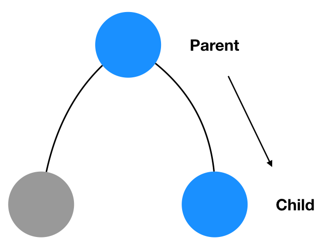

# Передача данных между компонентами

Бывают ситуации, когда вам нужно передать данные из одной компоненты, в другую компоненту, находящуюся рядом. Давайте рассмотрим способы общения компонент, находящихся в близком родстве друг c другом.

## 1. От родителя к ребенку



### Данный метод имеет два подхода

- Передача значения через props
- С помощью instance methods

При передачи данных через props, мы просто передаём нужные данные нашему ребенку. Если данные в родителе меняются, мы меняем эти данные в props и ребенок получает новые значения.

В данном примере мы записываем в input значение родителя, через props это же значение получает и ребенок.

```javascript
class Children extends Component {
    render() {
        return (
        <div>
            <p>Ребенок</p>
            <p>{this.props.valueParent}</p>
        </div>
        );
    }
}

class Parent extends Component {
    state = {
        text: ""
    };

    chagheText = e => {
        this.setState({
        text: e.target.value
        });
    };

    render() {
        return (
        <div>
            <p>Родитель</p>
            <input type="text" onChange={this.chagheText} />
            <Children valueParent={this.state.text} />
        </div>
        );
    }
}
```

[](https://codesandbox.io/s/vn55q660n0)

При использовании встроенных методов, нужно использовать атрибут компонента ref.

```javascript
class Child extends React.Component {
    childMethod() {
        return "child method called";
    }

    render() {
        return <p>Child</p>;
    }
}

class Parent extends React.Component {
    componentDidMount() {
        console.log(
            this.child.childMethod() // child method called
        );
    }
    render() {
        return <Child ref={component => (this.child = component)} />;
    }
}
```

[](https://codesandbox.io/s/yvyv788mm1?expanddevtools=1)

## 2. От ребенка к родителю


### Так же данный метод имеет два подхода

- передача callback-функций
- event bubbling

С помощью callback-функций ребенок вызывает соответствующие метод у родителя.

```javascript
class Children extends Component {
    render() {
        return (
            <div>
                <p>Ребенок</p>
                <input type="text" onChange={this.props.chagheText} />
            </div>
        );
    }
}

class Parent extends Component {
    state = {
        text: ""
    };

    chagheText = e => {
        this.setState({
            text: e.target.value
        });
    };

    render() {
        return (
        <div>
            <p>Родитель</p>
            <p>{this.state.text}</p>
            <Children chagheText={this.chagheText} />
        </div>
        );
    }
}
```

[](https://codesandbox.io/s/m30vw2nqpp)

Второй метод основан на всплытии событий.

```javascript
const Child = () => <button>Click me</button>;

class Parent extends React {
    handleClick() {
        console.log("child clicked");
    }
    render() {
        return (
        <div onClick={this.handleClick}>
            <Child />
        </div>
        );
    }
}
```

[](https://codesandbox.io/s/oxx13m033z?expanddevtools=1)

## 3. От ребенка к ребенку


Данный пример скомбинирован из уже показанных методов. У ребенка меняется значение, он говорит своему родителю: "Смотри, мое значение изменилось, поменяй его у себя и присвой его всем братьями (или сестричкам :)"

```javascript
class Child1 extends Component{
    render(){

        const { valueChild1, callbackChild1 } = this.props;

        return(
            <div>
                <p>Ребенок 1</p>
                <input type="text" value={valueChild1} onChange={callbackChild1}/>
            </div>
        );
    }
}

class Child2 extends Component{
    render(){
        const { valueChild2, callbackChild2 } = this.props;
        return(
        <div>
            <p>Ребенок 2</p>
            <input type="text" value={valueChild2} onChange={callbackChild2} />
        </div>
        );
    }
}

class Parent extends React.Component {

    state = {
        text: 'denis'
    }

    handleCallbackChild = (e) =>{
        this.setState({
        text: e.target.value
        })
    }

    render() {
        return (
        <div>
            <p>Родитель</p>
            <p>{this.state.text}</p>
            <Child1
                valueChild1={this.state.text}
                callbackChild1={this.handleCallbackChild}
            />
            <Child2
                valueChild2={this.state.text}
                callbackChild2={this.handleCallbackChild}
            />
        </div>
        )
    }
}
```

[](https://codesandbox.io/s/jvmwxkxz0v)