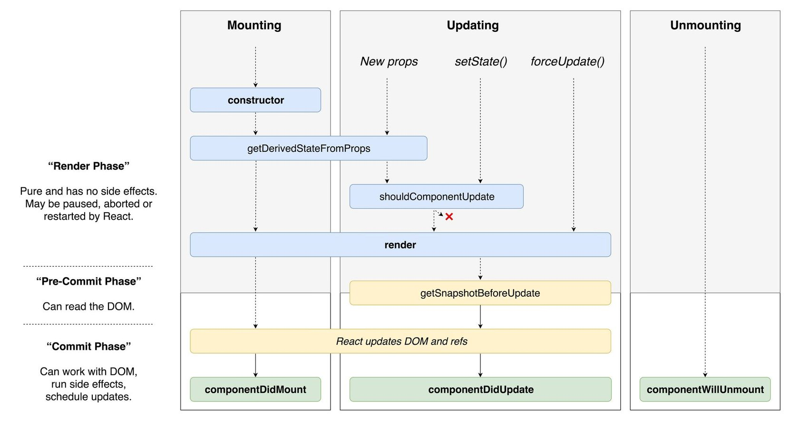

# Жизненный цикл компоненты

При создании компоненты с помощью класса, она имеет несколько встроенных функций, которые называют **lifecycle callbacks**, которые вызываются в зависимости от того, что происходит с компонентой.

Методы жизненного цикла доступны исключительно для **классовых** компонентов.

## Жизненный цикл компоненты условно можно разделить на три группы

- **Инициализация**. Когда наш компонент впервые будет помещаться в виртуальный, а затем и реальный DOM. Для этого реакт вызовет ряд методов жизненного цикла.
  
  - **componentWillMount()**. Вызывается перед построением компоненты.
  
  - **constructor(props)**. Конструктор обычно используется для инициализации state компоненты. Если вам не нужно инициализировать состояние от props, то лучше его не использовать.
  
  - **render()** функция является **обязательной**, которая должна возвращать ```null```, ```string```, портал, ```boolean``` или ```jsx```. Если возвращается ```boolean``` значение или ```null```, то компонент не будет отрендерен. Он не должен содержать setState, запросов к серверу, его главная задачей построить виртуальный DOM.
  
  - **componentDidMount()**. Эта функция вызывается сразу же после вызова функции render. Она используется если вам нужно запустить таймеры, получить данные от сервера или получить значения от DOM.
  
    Возьмем пример из [документации](https://reactjs.org/docs/state-and-lifecycle.html) реакта, благодаря ```console.log``` можно посмотреть в какой очередности вызываются методы.

    ```jsx
        class Clock extends Component {
            constructor(props) {
                super(props);
                this.state = {
                    date: new Date()
                };
                console.log("конструктор");
            }

            componentWillUnmount() {
                console.log("componentWillUnmount");
            }

            componentDidMount() {
                console.log("componentDidMount");
            }

            render() {
                console.log("ОБЯЗАТЕЛЬНЫЙ метод render");
                return (
                    <div>
                        <h1>Hello, world!</h1>
                        <h2>It is {this.state.date.toLocaleTimeString()}.</h2>
                    </div>
                );
            }
        }
    ```

    [](https://codesandbox.io/s/r1r8j309rn)

- **Обновление**. Обновление может происходить по двум причинам либо компонент изменил состояние, либо родитель.

  - **componentWillReceiveProps(nextProps)**. Передает новые prop, с которыми будет строится виртуальный DOM.

  - **shouldComponentUpdate(nextProps, nextState)**. Эта метод сообщает реакту, нужно ли вызывать функцию render для компоненты, когда у нее изменились её props или state. Функция должна вернуть булево значение.

  - **componentWillUpdate(nextProps, nextState)**. Предупреждает о том, что мы сейчас будет перестраивать виртуальный DOM для данного компонента. У нас уже есть готовые pops и state. Если props изменились, и shouldComponentUpdate возвращает false методы componentWillUpdate, render и compoentDidUpdate не будут вызваны.

  - **render()**

  - **componentDidUpdate(prevProps, prevState)**. В котором также есть доступ к прошлым pops и state и к современным props и state. Прошлые живут в аргументах функции, а современные в ```this.props``` и ```this.state```. Чаще всего данный метод используется, если нас интересуют составляющие реального DOM (размер, позиционирование и т.д.)

  В примере у нас есть два компонента Parent и Clock. Чтобы заглянуть в будущие мы должны нажать на кнопку, по нажатию родительский компонент в props передает будущие время. Для лучшего усвоения нужно поиграться с кодом :)

  ```jsx
        class Parent extends Component {
            state = {
                date: new Date()
            };

            changeTime = () => {
                this.setState(({ date }) => {
                    date.setHours(date.getHours() + 1); // Прибавляем один час
                    return {
                        date: date
                    };
                });
            };

            render() {
                return <Clock date={this.state.date} changeTime={this.changeTime} />;
            }
        }

        class Clock extends Component {
            // Методы инициализации
            constructor(props) {
                super(props);
                this.state = {
                    date: new Date()
                };
                console.log("вызов конструктора");
            }

            componentWillUnmount() {
                console.log("componentWillUnmount");
            }

            componentDidMount() {
                console.log("componentDidMount");
            }

            componentWillReceiveProps(nextProps) {
                console.log("componentWillReceiveProps");
                this.setState({
                    date: nextProps.date
                });
            }

            // Методы обновления
            shouldComponentUpdate(nextProps, nextState) {
                console.log("shouldComponentUpdate");
                return true; // вызываем render
            }

            componentWillUpdate(nextProps, nextState) {
                console.log("componentWillUpdate");
            }

            componentDidUpdate(prevProps, prevState) {
                console.log("componentDidUpdate");
            }

            render() {
                console.log("ОБЯЗАТЕЛЬНЫЙ метод render");
                return (
                <div>
                    <h1>Hello, world!</h1>
                    <h2>It is {this.state.date.toLocaleTimeString()}.</h2>
                    <button onClick={this.props.changeTime}>Заглянуть в будущие</button>
                </div>
                );
            }
        }
    ```

    [](https://codesandbox.io/s/mzlp9rz3zy?expanddevtools=1)

- **Удаление**
  - **componentWillUnmount()**. Единственный метод, который вызывается перед удалением. В этом методе отключают eventListener, если они есть и отменяют сетевые запросы.

И в заключении приведу схему порядка вызовов методов компоненты.

