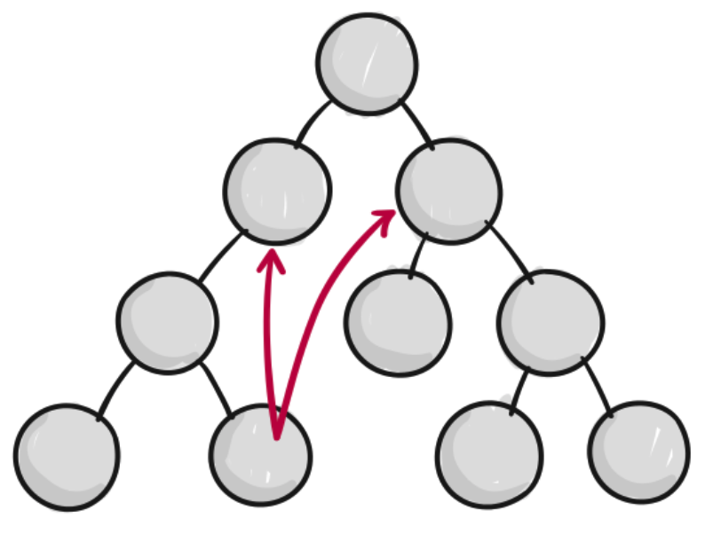
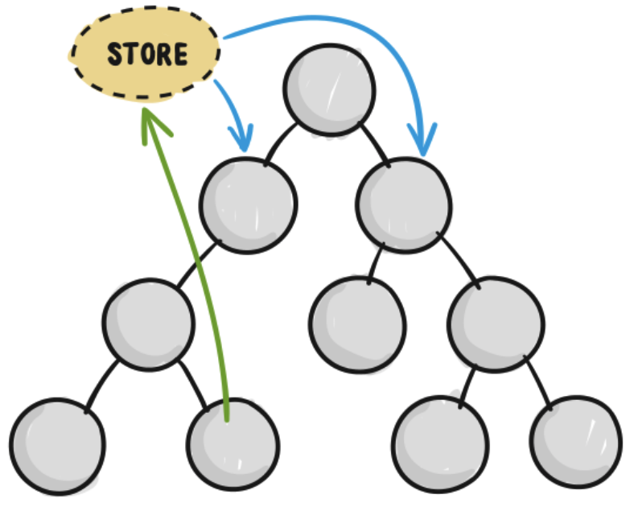
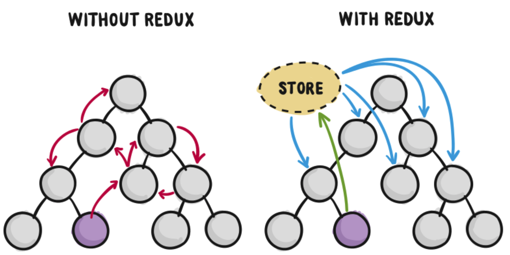

# Redux

Redux является внешним контейнером состояния для JavaScript-приложений.

Redux — это инструмент управления как состоянием данных, так и состоянием интерфейса в JavaScript-приложениях. Он подходит для одностраничных приложений, при росте которых управление состоянием со временем становится сложным.

Redux не связан с каким-то определенным фреймворком, и хотя разрабатывался для React, может использоваться с Angular, Vue или jQuery.

Данные в React проходят через компоненты, сверху вниз. Это называется «однонаправленный поток данных» — поток данных проходит в одном направлении, от родителя к ребенку. При этом не очевидно, как два компонента, не связанные отношением родитель-ребенок, будут взаимодействовать между собой:



В React не рекомендуется реализовывать прямое взаимодействие компонент-компонент. Это считается плохой практикой, приводит к ошибкам и **спагетти-коду** — старый термин для запутанного кода.

Вот здесь и будет полезен Redux. Redux предлагает хранить все состояние приложения в одном месте, называемом «store» («хранилище»).

Компоненты «отправляют» изменение состояния в хранилище, а не напрямую другим компонентам. Компоненты, которые должны быть в курсе этих изменений, «подписываются» на хранилище:



Хранилище может рассматриваться, как «посредник» во всех изменениях состояния приложения.

С Redux компоненты не связываются друг с другом напрямую, все изменения должны пройти через единственный источник истины, через хранилище.



## Redux может быть описан тремя фундаментальными принципами

1. **Единственный источник истины**.
Redux использует только одно хранилище для всего состояния приложения. Поскольку состояние находится в одном месте, его называет единственным источником истины.

2. **Cостояние доступно только для чтения**. Согласно документации Redux, «Единственный способ изменить состояние — передать «action»— объект, описывающий, что произошло». Это означает, что приложение не может напрямую изменить состояние. Вместо этого, необходимо передать «action», чтобы выразить намерение изменить состояние в хранилище.
   
3. **Изменения делаются «чистыми» функциями**. Итак, Redux не позволяет изменять состояние напрямую. Вместо этого «action» описывает, какие изменения необходимо сделать. Редьюсеры (reducers) — это функции, которые обрабатывают «action» и могут вносить изменения в состояние.

Немного забежим вперед, чтобы изложение материала было удобнее и понятнее, хранилище состояния будем называть Store. Он имеет очень маленький API, состоящий всего из четырех методов: 

```javascript
//Отправить действие в store 
store.dispatch(action);

//Добавляет слушателя
store.subscribe(listener);

//Возвращает текущее состояние вашего приложения 
store.getState();

//Заменяет редьюсер, который в настоящее время используется хранилищем 
replaceReducer(nextReducer);
```